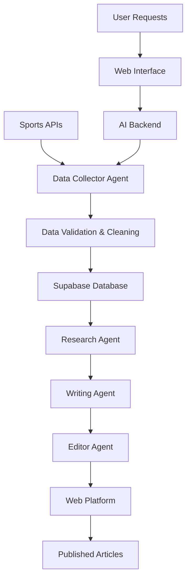
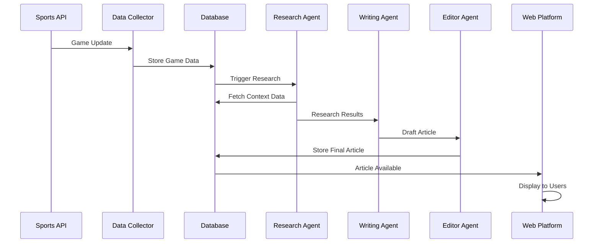

# Data Flow Architecture

## Overview

Sport Scribe implements a sophisticated data flow architecture that enables
real-time sports article generation through a multi-agent AI system. This
document outlines the complete data journey from external sources to published
articles.

## High-Level Data Flow

## Detailed Data Flow Components

### 1. Data Ingestion Layer

#### External Data Sources

- **Sports APIs**: Real-time game data, statistics, and updates
- **News Feeds**: Breaking sports news and updates
- **Social Media**: Player and team social media content
- **Historical Data**: Past games, season statistics, player records

#### Data Collector Agent

- **Purpose**: Fetch and normalize data from multiple sources
- **Operations**:
  - API polling and webhook handling
  - Data format standardization
  - Rate limiting and error handling
  - Data freshness validation

#### Data Validation & Cleaning

- **Schema Validation**: Ensure data conforms to expected formats
- **Data Quality Checks**: Validate completeness and accuracy
- **Deduplication**: Remove duplicate entries
- **Sanitization**: Clean and normalize text content

### 2. Storage Layer

#### Supabase Database

- **Games Table**: Game schedules, scores, and metadata
- **Teams Table**: Team information and statistics
- **Players Table**: Player profiles and performance data
- **Articles Table**: Generated articles and metadata
- **User Preferences**: User customization and settings

#### Real-time Subscriptions

- **Live Updates**: Real-time game score updates
- **Event Triggers**: Automatic article generation triggers
- **User Notifications**: Real-time notifications for article updates

### 3. AI Processing Pipeline

#### Research Agent

- **Input**: Raw game and team data
- **Processing**:
  - Historical context analysis
  - Statistical trend identification
  - Player performance correlation
  - Team dynamics assessment
- **Output**: Structured research context for article generation

#### Writing Agent

- **Input**: Research context and game data
- **Processing**:
  - Content structure planning
  - Narrative generation
  - Style and tone application
  - SEO optimization
- **Output**: Draft article content

#### Editor Agent

- **Input**: Draft article content
- **Processing**:
  - Grammar and style checking
  - Fact verification
  - Content quality assessment
  - Final formatting and optimization
- **Output**: Publication-ready articles

### 4. Content Delivery Layer

#### Web Platform

- **Article Display**: Responsive article presentation
- **Search and Discovery**: Content categorization and search
- **User Interaction**: Comments, sharing, and engagement
- **Performance Optimization**: Caching and CDN delivery

## Data Flow Patterns

### Real-time Article Generation

### Batch Processing Workflow

## Data Governance

### Data Quality Standards

- **Accuracy**: Validation against multiple sources
- **Completeness**: Required field validation
- **Timeliness**: Freshness requirements for real-time data
- **Consistency**: Format standardization across sources

### Privacy and Security

- **Data Encryption**: At-rest and in-transit encryption
- **Access Controls**: Role-based database access
- **Audit Logging**: Complete data access tracking
- **GDPR Compliance**: User data protection measures

### Performance Considerations

- **Caching Strategy**: Multi-level caching implementation
- **Database Optimization**: Query optimization and indexing
- **API Rate Limiting**: Respect external API constraints
- **Horizontal Scaling**: Load distribution across agents

## Monitoring and Observability

### Data Flow Metrics

- **Ingestion Rate**: Data points processed per minute
- **Processing Latency**: End-to-end article generation time
- **Error Rates**: Failed API calls and processing errors
- **Data Quality Scores**: Validation success rates

### Alerting and Notifications

- **Data Source Failures**: API outages or connectivity issues
- **Processing Bottlenecks**: Agent performance degradation
- **Quality Threshold Breaches**: Data accuracy concerns
- **System Health**: Overall pipeline status

## Future Enhancements

### Planned Improvements

- **Machine Learning Integration**: Predictive content optimization
- **Multi-language Support**: Internationalization capabilities
- **Advanced Analytics**: User engagement pattern analysis
- **Real-time Collaboration**: Multi-user content editing

### Scalability Roadmap

- **Microservices Architecture**: Service decomposition strategy
- **Event-driven Architecture**: Async processing optimization
- **Global CDN Integration**: Worldwide content delivery
- **AI Model Versioning**: ML model deployment pipeline

---

**Last Updated:** January 2025
**Version:** 1.0
**Maintainer:** Sport Scribe Architecture Team
