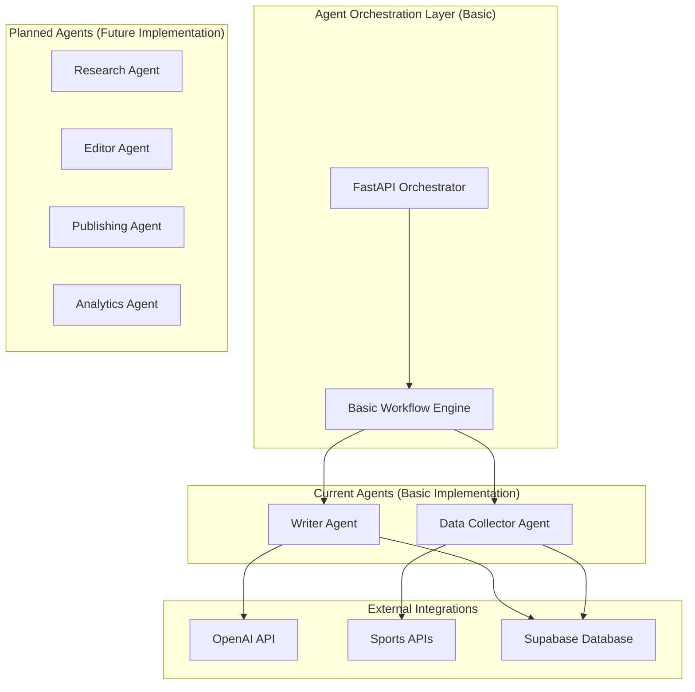
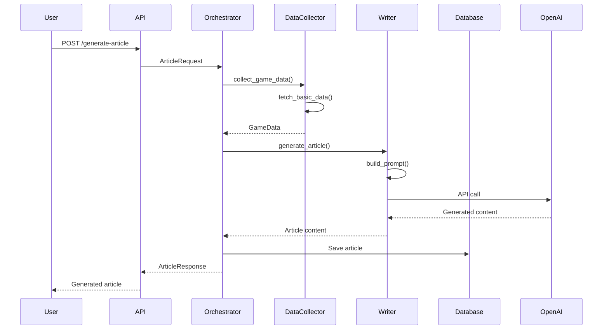
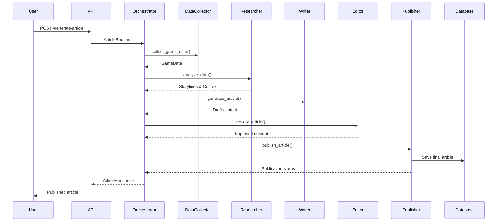

# Multi-Agent Design

This document describes the multi-agent AI system that powers Sport Scribe's automated content generation capabilities.

## Multi-Agent System Status

### Currently Implemented (Basic)
- **Data Collection Agent**: Basic structure for fetching sports data
- **Writing Agent**: Basic text generation capabilities using AI models
- **Main Orchestrator**: FastAPI endpoints for coordinating agent workflows

### Planned for Implementation
- **Research Agent**: Enhanced context gathering and fact verification
- **Editor Agent**: Content review and quality improvement
- **Publishing Agent**: Multi-platform publishing and scheduling
- **Analytics Agent**: Performance tracking and optimization

### Current Capabilities
The system currently supports:
- Basic article generation workflow
- Simple agent coordination via FastAPI
- Integration points prepared for enhanced agent capabilities
- Extensible architecture for adding new agent types

### Development Notes
- Agent implementations are currently basic/placeholder level
- Core framework is in place for expansion
- Focus is on establishing solid foundation before adding complexity
- Agents can be enhanced incrementally as requirements are refined

## Overview

Sport Scribe is designed to use a multi-agent architecture where specialized AI agents will collaborate to create high-quality sports articles. The current implementation provides a foundation for this system, with basic agent structures in place and room for future enhancement.

## Agent Architecture



## Current Agent Implementations

### 1. Data Collector Agent (Basic)

**Purpose**: Gathers sports data from various sources.

**Current Implementation**:
- Basic structure for data collection
- Integration points for sports APIs
- Simple data normalization
- Error handling framework

**Configuration**:
```python
class DataCollectorConfig:
    model: str = "gpt-4"
    max_sources: int = 3
    timeout_seconds: int = 30
    retry_attempts: int = 2
```

**Example Implementation**:
```python
class DataCollectorAgent(BaseAgent):
    def __init__(self, config: DataCollectorConfig):
        super().__init__(config)
        self.sources = []  # To be populated with actual sources

    async def collect_game_data(self, game_id: str) -> Optional[GameData]:
        """Collect basic game data from available sources."""
        try:
            # Basic implementation - to be enhanced
            logger.info(f"Collecting data for game {game_id}")
            return await self._fetch_basic_data(game_id)
        except Exception as e:
            logger.error(f"Data collection failed: {e}")
            return None

    async def _fetch_basic_data(self, game_id: str) -> GameData:
        """Fetch basic game data - placeholder implementation."""
        # Placeholder implementation
        return GameData(
            id=game_id,
            teams=["Team A", "Team B"],
            score={"Team A": 0, "Team B": 0},
            status="scheduled"
        )
```

### 2. Writer Agent (Basic)

**Purpose**: Generates sports articles using AI models.

**Current Implementation**:
- Basic OpenAI integration
- Simple prompt engineering
- Article structure generation
- Basic error handling

**Configuration**:
```python
class WriterConfig:
    model: str = "gpt-4"
    max_tokens: int = 2000
    temperature: float = 0.7
    prompt_template: str = "default"
```

**Example Implementation**:
```python
class WriterAgent(BaseAgent):
    def __init__(self, config: WriterConfig):
        super().__init__(config)
        self.client = OpenAI(api_key=config.openai_api_key)

    async def generate_article(self, request: ArticleRequest) -> Optional[str]:
        """Generate a basic sports article."""
        try:
            prompt = self._build_prompt(request)
            response = await self.client.chat.completions.create(
                model=self.config.model,
                messages=[{"role": "user", "content": prompt}],
                max_tokens=self.config.max_tokens,
                temperature=self.config.temperature
            )
            return response.choices[0].message.content
        except Exception as e:
            logger.error(f"Article generation failed: {e}")
            return None

    def _build_prompt(self, request: ArticleRequest) -> str:
        """Build a basic prompt for article generation."""
        return f"""
        Write a sports article about game {request.game_id}.
        Focus: {request.focus_type}
        Target length: {request.target_length} words
        """
```

### 3. Main Orchestrator (Current)

**Purpose**: Coordinates agent workflows and manages API endpoints.

**Current Implementation**:
- FastAPI-based coordination
- Basic workflow management
- Agent lifecycle management
- Simple error handling

**Example Implementation**:
```python
class AgentOrchestrator:
    def __init__(self):
        self.data_collector = DataCollectorAgent(DataCollectorConfig())
        self.writer = WriterAgent(WriterConfig())

    async def generate_article(self, request: ArticleRequest) -> ArticleResponse:
        """Orchestrate the article generation process."""
        try:
            # Step 1: Collect data
            game_data = await self.data_collector.collect_game_data(request.game_id)
            if not game_data:
                raise AgentError("Failed to collect game data")

            # Step 2: Generate article
            article_content = await self.writer.generate_article(request)
            if not article_content:
                raise AgentError("Failed to generate article")

            # Step 3: Return response
            return ArticleResponse(
                id=str(uuid.uuid4()),
                title=self._extract_title(article_content),
                content=article_content,
                status="generated"
            )
        except Exception as e:
            logger.error(f"Article generation orchestration failed: {e}")
            raise AgentError(f"Generation failed: {e}")

    def _extract_title(self, content: str) -> str:
        """Extract title from article content - basic implementation."""
        lines = content.split('\n')
        return lines[0] if lines else "Generated Article"
```

## Planned Agent Enhancements

### 1. Research Agent (Future)

**Purpose**: Analyze data to identify storylines and provide context.

**Planned Capabilities**:
- Statistical analysis and trend identification
- Historical context research
- Player and team performance analysis
- Storyline extraction and ranking
- Fact verification and cross-referencing

### 2. Editor Agent (Future)

**Purpose**: Review and improve generated content.

**Planned Capabilities**:
- Grammar and style checking
- Factual accuracy verification
- Tone and voice consistency
- Content structure optimization
- SEO optimization

### 3. Publishing Agent (Future)

**Purpose**: Handle content publication and distribution.

**Planned Capabilities**:
- Multi-platform publishing
- Content scheduling
- Social media integration
- SEO metadata generation
- Analytics tracking

### 4. Analytics Agent (Future)

**Purpose**: Track performance and optimize content.

**Planned Capabilities**:
- Content performance analysis
- User engagement tracking
- A/B testing coordination
- Optimization recommendations
- Reporting and insights

## Current Workflow



## Future Workflow (Planned)



## Agent Communication

### Current Communication (Basic)
- Direct method calls between agents
- Simple data passing through orchestrator
- Basic error handling and logging

### Planned Communication (Future)
- Message-based communication
- Event-driven architecture
- Async task queues
- Distributed processing

```python
# Current: Direct method calls
article = await writer.generate_article(request)

# Future: Message-based communication
await message_bus.publish(
    topic="article.generation.requested",
    data=request,
    agent="writer"
)
```

## Configuration Management

### Current Configuration
```python
class AgentConfig:
    """Base configuration for all agents."""
    model: str = "gpt-4"
    timeout_seconds: int = 30
    retry_attempts: int = 2
    log_level: str = "INFO"

class SystemConfig:
    """Overall system configuration."""
    openai_api_key: str
    supabase_url: str
    supabase_key: str
    agent_configs: Dict[str, AgentConfig]
```

### Future Configuration (Planned)
```python
class AdvancedAgentConfig:
    """Advanced agent configuration."""
    model: str
    fine_tuned_model: Optional[str]
    temperature: float
    max_tokens: int
    custom_prompts: Dict[str, str]
    performance_metrics: Dict[str, Any]
    quality_thresholds: Dict[str, float]
```

## Error Handling and Resilience

### Current Error Handling
- Basic try-catch blocks
- Simple logging
- Graceful degradation
- Timeout handling

### Planned Error Handling (Future)
- Comprehensive error classification
- Retry strategies with exponential backoff
- Circuit breaker patterns
- Fallback mechanisms
- Detailed error reporting

## Development Roadmap

### Phase 1: Foundation (Current)
- [x] Basic agent structure
- [x] Simple orchestration
- [x] OpenAI integration
- [x] FastAPI endpoints

### Phase 2: Enhancement (Next)
- [ ] Improved data collection
- [ ] Enhanced prompting
- [ ] Better error handling
- [ ] Performance optimization

### Phase 3: Advanced Features (Future)
- [ ] Research agent implementation
- [ ] Editor agent implementation
- [ ] Advanced orchestration
- [ ] Quality metrics

### Phase 4: Intelligence (Future)
- [ ] Machine learning integration
- [ ] Custom model training
- [ ] Adaptive behavior
- [ ] Performance analytics

## Testing Strategy

### Current Testing
- Basic unit tests for agent methods
- Integration tests for API endpoints
- Manual testing of generation workflow

### Planned Testing (Future)
- Comprehensive unit test coverage
- Integration tests for agent communication
- Performance testing for scalability
- Quality testing for content output
- A/B testing for optimization

## Performance Considerations

### Current Performance
- Single-threaded processing
- Simple caching mechanisms
- Basic optimization

### Planned Performance (Future)
- Async processing for all agents
- Distributed computing capabilities
- Advanced caching strategies
- Real-time performance monitoring

## Conclusion

The multi-agent system for Sport Scribe is designed with a solid foundation that can be expanded incrementally. The current implementation provides basic functionality while establishing the architecture needed for future enhancements. Each agent can be improved independently, allowing for gradual evolution of the system's capabilities.

The focus remains on building a robust, scalable foundation that can support increasingly sophisticated AI-powered sports journalism as the system matures.
