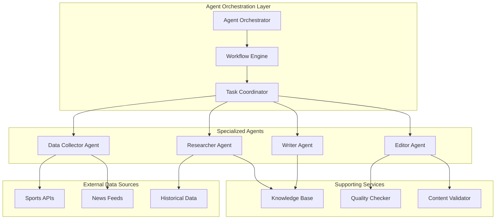
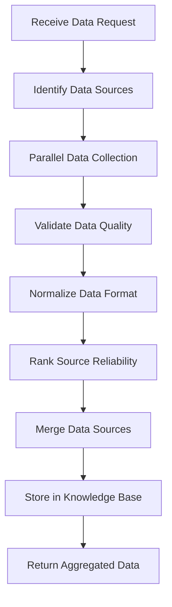
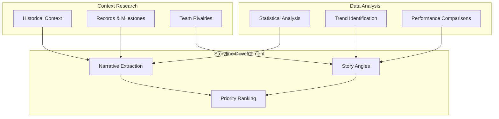
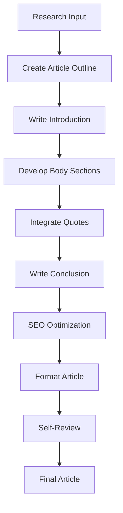
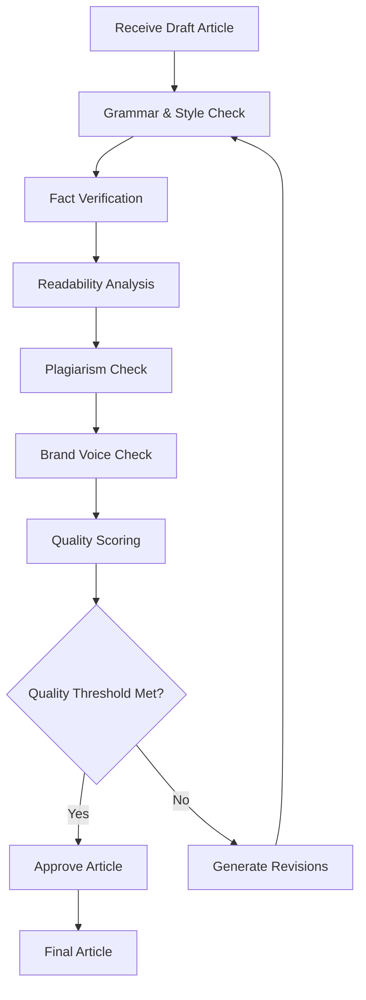
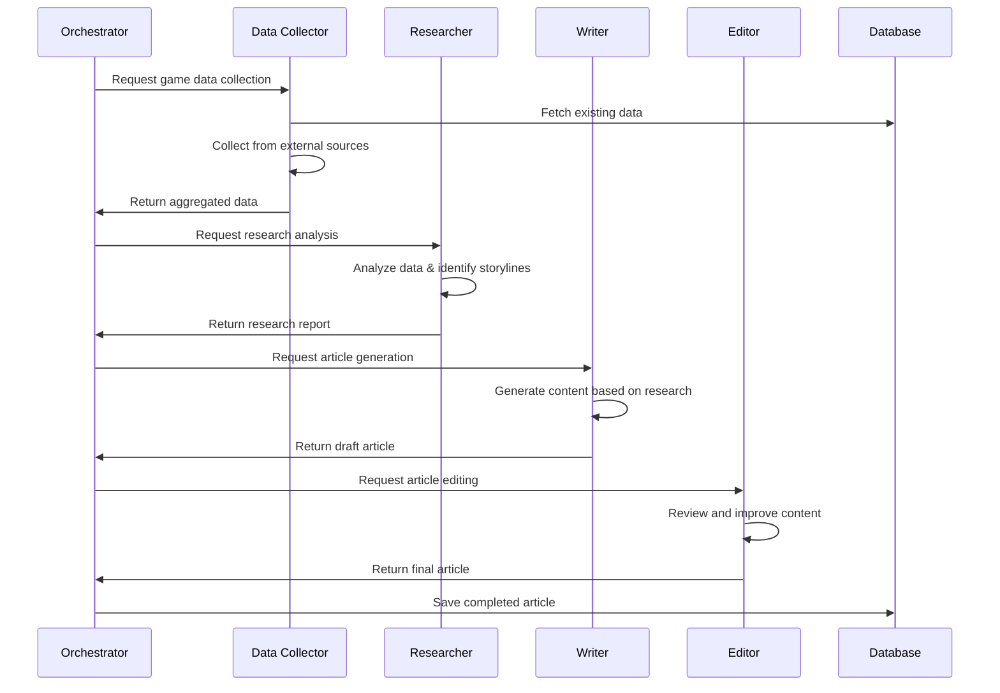
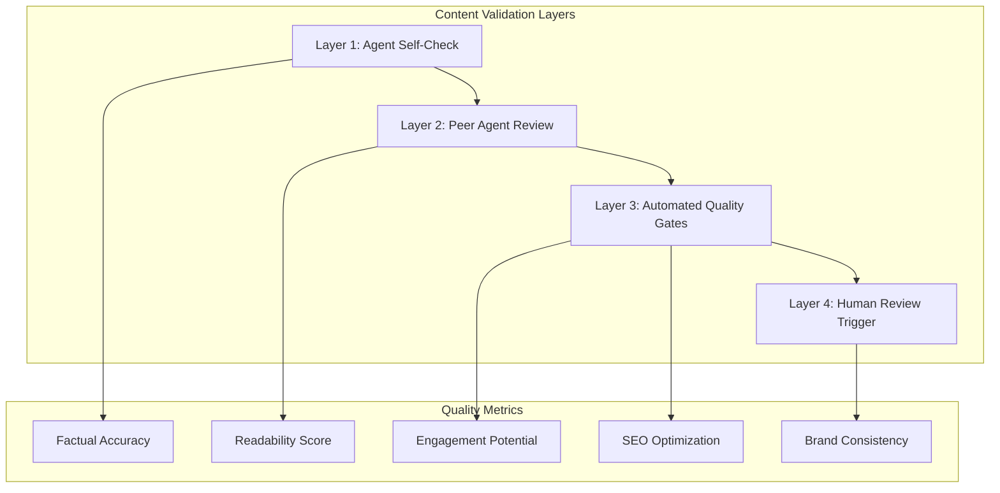

# Multi-Agent Design

This document describes the multi-agent AI system that powers Sport Scribe's automated content generation capabilities.

## Overview

Sport Scribe uses a sophisticated multi-agent architecture where specialized AI agents collaborate to create high-quality sports articles. Each agent has specific responsibilities and capabilities, working together in a coordinated workflow to transform raw sports data into engaging content.

## Agent Architecture



## Agent Specifications

### 1. Data Collector Agent

**Purpose**: Gathers and aggregates sports data from multiple sources.

**Capabilities**:
- Real-time sports data collection
- Historical data retrieval
- Data normalization and standardization
- Source reliability assessment
- Data freshness validation

**Configuration**:
```python
class DataCollectorConfig:
    model: str = "gpt-4"
    max_sources: int = 10
    timeout_seconds: int = 30
    retry_attempts: int = 3
    data_freshness_threshold: int = 300  # 5 minutes
    reliability_threshold: float = 0.8
```

**Workflow**:


**Example Implementation**:
```python
class DataCollectorAgent(BaseAgent):
    def __init__(self, config: DataCollectorConfig):
        super().__init__(config)
        self.sources = [
            ESPNDataSource(),
            NBADataSource(),
            CustomSportsAPI()
        ]
    
    async def collect_game_data(self, game_id: str) -> GameData:
        """Collect comprehensive game data from multiple sources."""
        tasks = []
        for source in self.sources:
            task = asyncio.create_task(
                source.fetch_game_data(game_id)
            )
            tasks.append(task)
        
        results = await asyncio.gather(*tasks, return_exceptions=True)
        
        # Filter successful results and validate
        valid_data = []
        for result in results:
            if not isinstance(result, Exception):
                if self.validate_data_quality(result):
                    valid_data.append(result)
        
        # Merge and normalize data
        return self.merge_data_sources(valid_data)
    
    def validate_data_quality(self, data: dict) -> bool:
        """Validate data quality and completeness."""
        required_fields = ['game_id', 'teams', 'score', 'status']
        return all(field in data for field in required_fields)
```

### 2. Researcher Agent

**Purpose**: Analyzes collected data to identify key storylines, trends, and narrative angles.

**Capabilities**:
- Statistical analysis and trend identification
- Historical context research
- Player and team performance analysis
- Storyline extraction and ranking
- Fact verification and cross-referencing

**Configuration**:
```python
class ResearcherConfig:
    model: str = "gpt-4"
    analysis_depth: str = "comprehensive"
    storyline_count: int = 5
    historical_context_years: int = 3
    statistical_significance_threshold: float = 0.05
    fact_check_sources: int = 3
```

**Analysis Framework**:


**Example Implementation**:
```python
class ResearcherAgent(BaseAgent):
    def __init__(self, config: ResearcherConfig):
        super().__init__(config)
        self.analyzers = [
            StatisticalAnalyzer(),
            TrendAnalyzer(),
            HistoricalContextAnalyzer(),
            NarrativeExtractor()
        ]
    
    async def research_game(self, game_data: GameData) -> ResearchReport:
        """Conduct comprehensive research on game data."""
        
        # Parallel analysis across different dimensions
        analysis_tasks = [
            self.analyze_statistics(game_data),
            self.identify_trends(game_data),
            self.research_historical_context(game_data),
            self.extract_storylines(game_data)
        ]
        
        results = await asyncio.gather(*analysis_tasks)
        
        # Synthesize findings
        research_report = ResearchReport(
            statistical_insights=results[0],
            trend_analysis=results[1],
            historical_context=results[2],
            storylines=results[3],
            confidence_score=self.calculate_confidence(results)
        )
        
        return research_report
    
    async def analyze_statistics(self, game_data: GameData) -> StatisticalInsights:
        """Analyze game statistics for notable patterns."""
        prompt = f"""
        Analyze the following game statistics and identify:
        1. Standout individual performances
        2. Team performance anomalies
        3. Statistical milestones achieved
        4. Performance compared to season averages
        
        Game Data: {game_data.to_dict()}
        """
        
        response = await self.llm_client.generate(prompt)
        return StatisticalInsights.from_text(response)
```

### 3. Writer Agent

**Purpose**: Generates engaging article content based on research findings.

**Capabilities**:
- Multiple writing styles and tones
- SEO-optimized content generation
- Dynamic content length adjustment
- Quote integration and attribution
- Structured article formatting

**Configuration**:
```python
class WriterConfig:
    model: str = "gpt-4"
    writing_style: str = "professional"
    tone: str = "engaging"
    target_length: int = 800
    seo_optimization: bool = True
    include_quotes: bool = True
    readability_target: str = "grade_8"
```

**Writing Process**:


**Example Implementation**:
```python
class WriterAgent(BaseAgent):
    def __init__(self, config: WriterConfig):
        super().__init__(config)
        self.style_templates = {
            "professional": ProfessionalTemplate(),
            "casual": CasualTemplate(),
            "analytical": AnalyticalTemplate()
        }
    
    async def write_article(self, research: ResearchReport, focus: ArticleFocus) -> Article:
        """Generate a complete article based on research findings."""
        
        # Create article outline
        outline = await self.create_outline(research, focus)
        
        # Generate article sections
        sections = []
        for section in outline.sections:
            content = await self.write_section(section, research)
            sections.append(content)
        
        # Assemble final article
        article = Article(
            title=await self.generate_title(research, focus),
            introduction=sections[0],
            body=sections[1:-1],
            conclusion=sections[-1],
            metadata=self.generate_metadata(research)
        )
        
        # Apply SEO optimization
        if self.config.seo_optimization:
            article = await self.optimize_for_seo(article)
        
        return article
    
    async def generate_title(self, research: ResearchReport, focus: ArticleFocus) -> str:
        """Generate an engaging, SEO-friendly title."""
        prompt = f"""
        Create an engaging title for a sports article with the following parameters:
        
        Focus: {focus}
        Key Storylines: {research.storylines[:3]}
        Style: {self.config.writing_style}
        
        Requirements:
        - 60 characters or less for SEO
        - Include key players/teams
        - Action-oriented and engaging
        - Avoid clickbait
        """
        
        response = await self.llm_client.generate(prompt)
        return response.strip()
```

### 4. Editor Agent

**Purpose**: Reviews, refines, and validates generated content for quality and accuracy.

**Capabilities**:
- Grammar and style checking
- Fact verification
- Content quality assessment
- Readability optimization
- Plagiarism detection
- Brand voice consistency

**Configuration**:
```python
class EditorConfig:
    model: str = "gpt-4"
    quality_threshold: float = 0.8
    fact_check_enabled: bool = True
    plagiarism_check: bool = True
    readability_target: int = 8  # Grade level
    brand_voice_check: bool = True
    max_revisions: int = 3
```

**Editing Workflow**:


**Example Implementation**:
```python
class EditorAgent(BaseAgent):
    def __init__(self, config: EditorConfig):
        super().__init__(config)
        self.quality_checkers = [
            GrammarChecker(),
            FactChecker(),
            ReadabilityAnalyzer(),
            PlagiarismDetector(),
            BrandVoiceChecker()
        ]
    
    async def edit_article(self, article: Article) -> EditedArticle:
        """Comprehensive editing and quality assurance."""
        
        current_article = article
        revision_count = 0
        
        while revision_count < self.config.max_revisions:
            # Run all quality checks
            quality_report = await self.assess_quality(current_article)
            
            if quality_report.overall_score >= self.config.quality_threshold:
                break
            
            # Generate improvements
            current_article = await self.improve_article(
                current_article, 
                quality_report
            )
            revision_count += 1
        
        return EditedArticle(
            content=current_article,
            quality_score=quality_report.overall_score,
            revisions_made=revision_count,
            issues_resolved=quality_report.issues_resolved
        )
    
    async def assess_quality(self, article: Article) -> QualityReport:
        """Comprehensive quality assessment."""
        checks = await asyncio.gather(*[
            checker.analyze(article) for checker in self.quality_checkers
        ])
        
        return QualityReport.combine(checks)
```

## Agent Coordination

### Workflow Orchestration



### Inter-Agent Communication

```python
class AgentMessage:
    """Standard message format for inter-agent communication."""
    sender: str
    recipient: str
    message_type: MessageType
    payload: dict
    timestamp: datetime
    correlation_id: str

class MessageBus:
    """Handles message routing between agents."""
    
    async def send_message(self, message: AgentMessage):
        """Route message to appropriate agent."""
        recipient_agent = self.get_agent(message.recipient)
        await recipient_agent.handle_message(message)
    
    async def broadcast(self, message: AgentMessage, recipients: List[str]):
        """Send message to multiple agents."""
        tasks = [
            self.send_message(
                AgentMessage(
                    sender=message.sender,
                    recipient=recipient,
                    message_type=message.message_type,
                    payload=message.payload,
                    timestamp=message.timestamp,
                    correlation_id=message.correlation_id
                )
            ) for recipient in recipients
        ]
        await asyncio.gather(*tasks)
```

## Quality Control

### Multi-Layer Validation



### Quality Metrics

```python
class QualityMetrics:
    """Comprehensive quality assessment metrics."""
    
    factual_accuracy: float  # 0.0 - 1.0
    readability_score: float  # Flesch-Kincaid grade level
    engagement_score: float  # Predicted engagement potential
    seo_score: float  # SEO optimization score
    brand_consistency: float  # Brand voice alignment
    grammar_score: float  # Grammar and style score
    
    @property
    def overall_score(self) -> float:
        """Calculate weighted overall quality score."""
        weights = {
            'factual_accuracy': 0.3,
            'readability_score': 0.2,
            'engagement_score': 0.2,
            'seo_score': 0.15,
            'brand_consistency': 0.1,
            'grammar_score': 0.05
        }
        
        score = sum(
            getattr(self, metric) * weight 
            for metric, weight in weights.items()
        )
        return min(max(score, 0.0), 1.0)
```

## Performance Optimization

### Parallel Processing

```python
class ParallelAgentExecutor:
    """Optimizes agent execution through parallelization."""
    
    async def execute_parallel_workflow(self, game_id: str) -> Article:
        """Execute independent agent tasks in parallel."""
        
        # Phase 1: Data collection (sequential)
        data = await self.data_collector.collect_game_data(game_id)
        
        # Phase 2: Research and context gathering (parallel)
        research_tasks = [
            self.researcher.analyze_statistics(data),
            self.researcher.research_historical_context(data),
            self.researcher.identify_trends(data)
        ]
        research_results = await asyncio.gather(*research_tasks)
        research_report = ResearchReport.combine(research_results)
        
        # Phase 3: Content generation (sequential)
        draft = await self.writer.write_article(research_report)
        
        # Phase 4: Editing and quality assurance (parallel)
        editing_tasks = [
            self.editor.check_grammar(draft),
            self.editor.verify_facts(draft),
            self.editor.assess_readability(draft)
        ]
        editing_results = await asyncio.gather(*editing_tasks)
        final_article = self.editor.apply_improvements(draft, editing_results)
        
        return final_article
```

### Caching and Optimization

```python
class AgentCache:
    """Intelligent caching for agent operations."""
    
    def __init__(self, redis_client: Redis):
        self.redis = redis_client
        self.cache_ttl = {
            'game_data': 300,  # 5 minutes
            'research_results': 1800,  # 30 minutes
            'historical_context': 86400,  # 24 hours
        }
    
    async def get_or_compute(
        self, 
        cache_key: str, 
        compute_func: Callable,
        cache_type: str = 'default'
    ):
        """Get from cache or compute and cache result."""
        
        # Try to get from cache
        cached_result = await self.redis.get(cache_key)
        if cached_result:
            return json.loads(cached_result)
        
        # Compute result
        result = await compute_func()
        
        # Cache result
        ttl = self.cache_ttl.get(cache_type, 300)
        await self.redis.setex(
            cache_key, 
            ttl, 
            json.dumps(result, default=str)
        )
        
        return result
```

## Monitoring and Analytics

### Agent Performance Tracking

```python
class AgentMetrics:
    """Track agent performance and health metrics."""
    
    def __init__(self, metrics_client):
        self.metrics = metrics_client
    
    async def record_agent_execution(
        self, 
        agent_name: str, 
        task_type: str,
        execution_time: float,
        success: bool,
        quality_score: float = None
    ):
        """Record agent execution metrics."""
        
        self.metrics.histogram(
            f'agent.execution_time',
            execution_time,
            tags={'agent': agent_name, 'task': task_type}
        )
        
        self.metrics.increment(
            f'agent.task_count',
            tags={
                'agent': agent_name, 
                'task': task_type,
                'status': 'success' if success else 'failure'
            }
        )
        
        if quality_score is not None:
            self.metrics.histogram(
                f'agent.quality_score',
                quality_score,
                tags={'agent': agent_name, 'task': task_type}
            )
```

### Error Handling and Recovery

```python
class AgentErrorHandler:
    """Handles agent errors and implements recovery strategies."""
    
    async def execute_with_retry(
        self,
        agent_func: Callable,
        max_retries: int = 3,
        backoff_factor: float = 1.5
    ):
        """Execute agent function with exponential backoff retry."""
        
        for attempt in range(max_retries + 1):
            try:
                return await agent_func()
            except Exception as e:
                if attempt == max_retries:
                    raise e
                
                wait_time = backoff_factor ** attempt
                await asyncio.sleep(wait_time)
                
                # Log retry attempt
                logger.warning(
                    f"Agent execution failed, retrying in {wait_time}s. "
                    f"Attempt {attempt + 1}/{max_retries + 1}. Error: {e}"
                )
```

## Future Enhancements

### Planned Agent Capabilities

1. **Multimedia Agent**: Generate images, videos, and interactive content
2. **Social Media Agent**: Create platform-specific social media content
3. **Translation Agent**: Multi-language content generation
4. **Personalization Agent**: User-specific content customization
5. **Real-time Agent**: Live game commentary and updates

### Advanced AI Features

- **Custom Model Fine-tuning**: Sport-specific language models
- **Reinforcement Learning**: Agent performance optimization
- **Multi-modal Processing**: Text, image, and video analysis
- **Federated Learning**: Collaborative model improvement
- **Explainable AI**: Transparent decision-making processes

## Related Documentation

- [System Overview](./system-overview.md)
- [Data Flow](./data-flow.md)
- [AI Backend Setup](../deployment/ai-backend.md)
- [API Documentation](../api/)
- [Testing Guide](../development/testing.md)