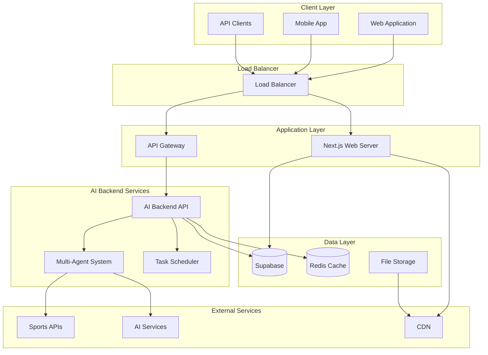
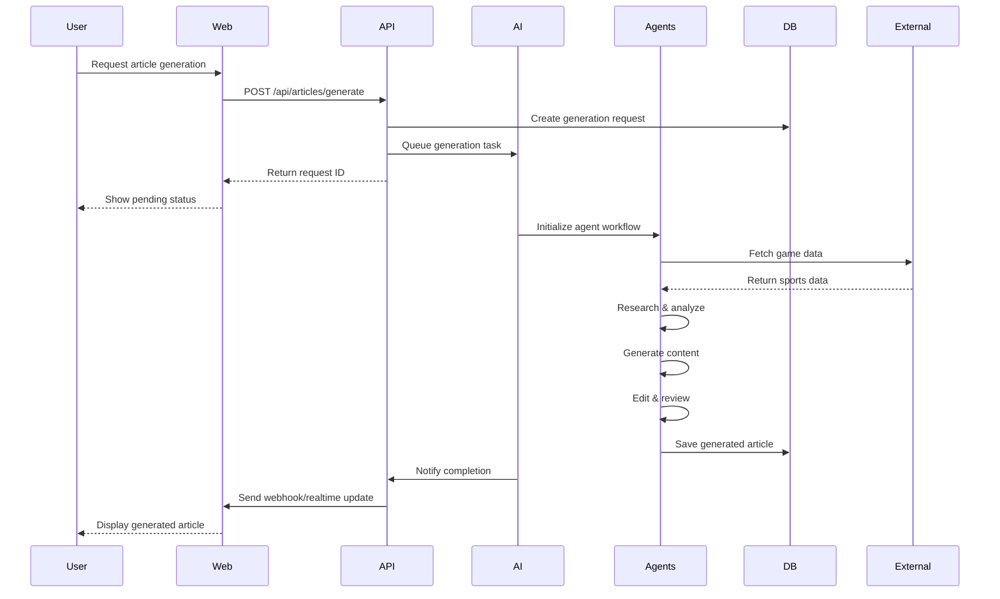
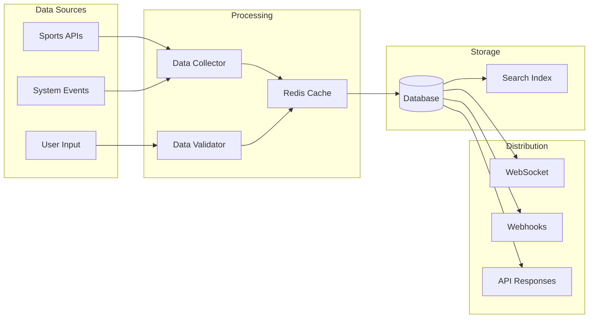
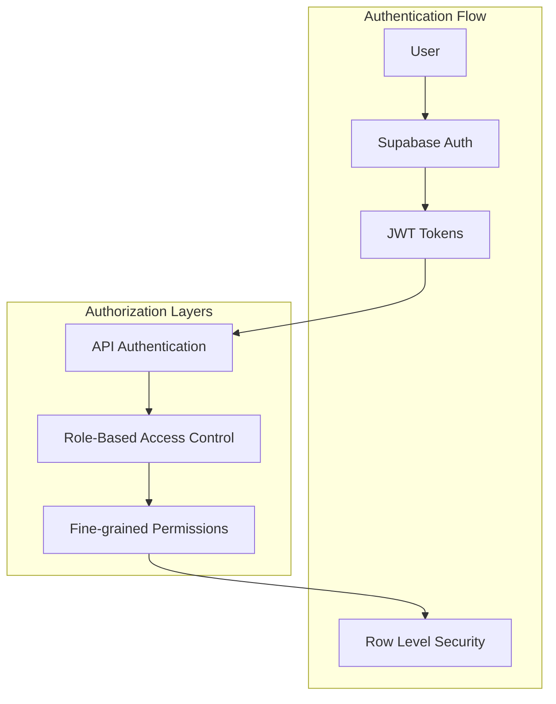
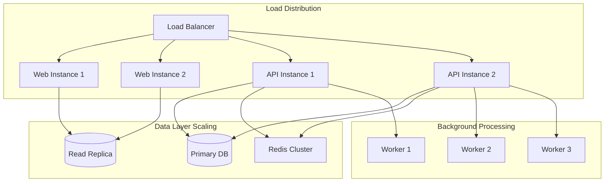
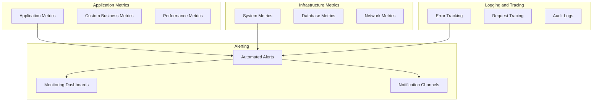
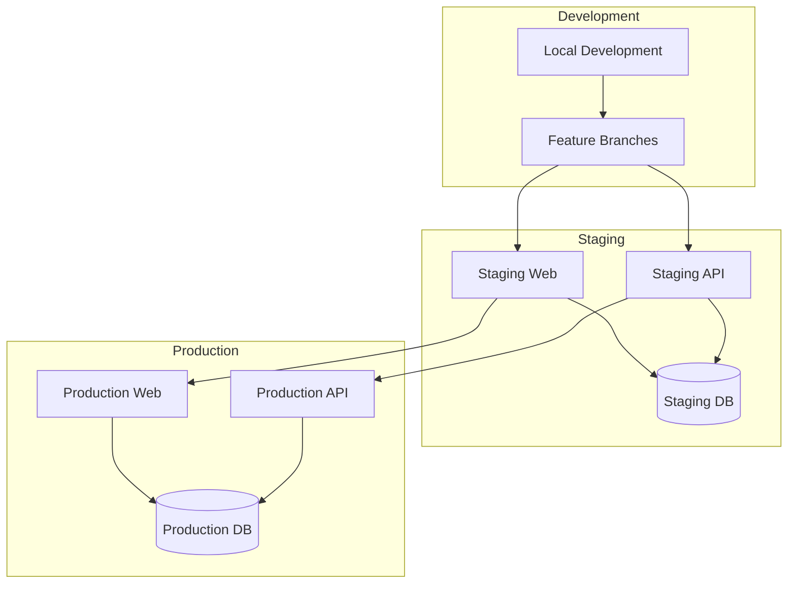
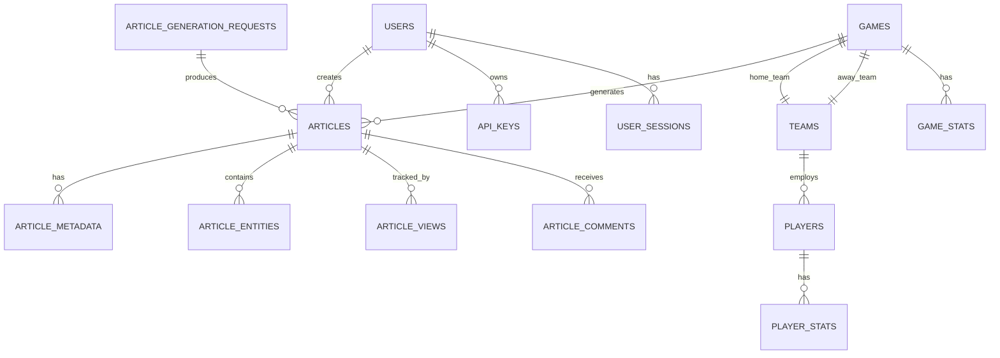
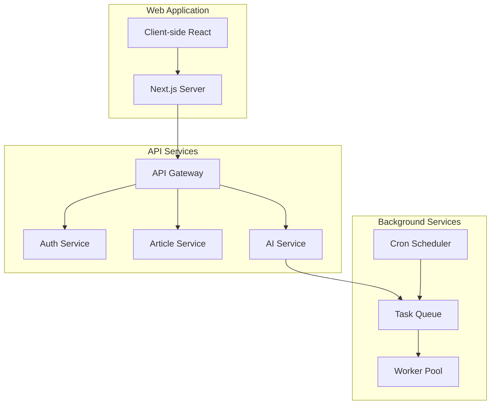

# System Overview

This document provides a high-level overview of the Sport Scribe system architecture, including its core components, data flow, and technology stack.

## Architecture Overview

Sport Scribe is a modern, cloud-native platform built using a microservices architecture pattern. The system is designed for scalability, reliability, and maintainability while providing AI-powered sports content generation capabilities.

## Core Components

### 1. Web Application (Frontend)

**Technology**: Next.js 14, React, TypeScript, Tailwind CSS

The web application provides the user interface for Sport Scribe, including:

- **Public Website**: Article browsing, search, and reading
- **Admin Dashboard**: Content management, analytics, and system configuration
- **User Portal**: Profile management, API key management, and preferences

**Key Features**:
- Server-side rendering (SSR) for SEO optimization
- Real-time updates using WebSocket connections
- Responsive design for mobile and desktop
- Progressive Web App (PWA) capabilities

### 2. AI Backend Services

**Technology**: Python, FastAPI, Celery, Redis

The AI backend is responsible for automated content generation using multiple AI agents:

- **Data Collector Agent**: Gathers sports data from various APIs
- **Researcher Agent**: Analyzes data and identifies key storylines
- **Writer Agent**: Generates article content using LLMs
- **Editor Agent**: Reviews and refines generated content

**Key Features**:
- Multi-agent orchestration
- Asynchronous task processing
- Real-time generation status updates
- Quality control and content validation

### 3. Database Layer

**Technology**: Supabase (PostgreSQL), Redis

**Supabase Database**:
- Primary data storage for articles, users, games, and system configuration
- Row Level Security (RLS) for data protection
- Real-time subscriptions for live updates
- Built-in authentication and authorization

**Redis Cache**:
- Session storage and caching
- Task queue for background jobs
- Rate limiting and API throttling
- Real-time data caching

### 4. API Gateway

**Technology**: FastAPI, Supabase Edge Functions

The API gateway provides:
- RESTful API endpoints
- Authentication and authorization
- Rate limiting and request validation
- API versioning and documentation
- Webhook management

### 5. External Integrations

**Sports Data APIs**:
- ESPN API for game data and statistics
- NBA API for basketball-specific data
- Custom data aggregation services

**AI Services**:
- OpenAI GPT models for content generation
- Custom fine-tuned models for sports writing
- Content quality assessment services

## Data Flow

### Article Generation Workflow

### Real-time Data Synchronization

## Technology Stack

### Frontend Technologies

| Component | Technology | Purpose |
|-----------|------------|---------|
| Framework | Next.js 14 | React-based full-stack framework |
| Language | TypeScript | Type-safe JavaScript development |
| Styling | Tailwind CSS | Utility-first CSS framework |
| State Management | Zustand | Lightweight state management |
| Data Fetching | TanStack Query | Server state management |
| Authentication | Supabase Auth | User authentication and authorization |
| Real-time | Supabase Realtime | Live data updates |

### Backend Technologies

| Component | Technology | Purpose |
|-----------|------------|---------|
| API Framework | FastAPI | High-performance Python API framework |
| Language | Python 3.11+ | Backend application development |
| Task Queue | Celery | Asynchronous task processing |
| Message Broker | Redis | Task queue and caching |
| Database | PostgreSQL | Primary data storage |
| ORM | SQLAlchemy | Database object-relational mapping |
| Validation | Pydantic | Data validation and serialization |
| Testing | pytest | Unit and integration testing |

### Infrastructure Technologies

| Component | Technology | Purpose |
|-----------|------------|---------|
| Database | Supabase | Managed PostgreSQL with real-time features |
| Hosting | Vercel (Web), Railway (API) | Cloud hosting platforms |
| CDN | Vercel Edge Network | Global content delivery |
| Monitoring | Sentry | Error tracking and performance monitoring |
| Analytics | PostHog | Product analytics and user tracking |
| CI/CD | GitHub Actions | Continuous integration and deployment |

### AI and ML Technologies

| Component | Technology | Purpose |
|-----------|------------|---------|
| LLM Provider | OpenAI GPT-4 | Large language model for content generation |
| Agent Framework | Custom Python | Multi-agent orchestration system |
| Data Processing | Pandas, NumPy | Data analysis and manipulation |
| Natural Language | spaCy | NLP processing and entity recognition |
| Content Quality | Custom Models | Content assessment and validation |

## Security Architecture

### Authentication and Authorization

**Security Features**:
- JWT-based authentication with automatic refresh
- Row Level Security (RLS) for database access control
- Role-based access control (RBAC) with fine-grained permissions
- API key authentication for service-to-service communication
- Rate limiting and DDoS protection
- HTTPS/TLS encryption for all communications

### Data Protection

- **Encryption at Rest**: All data encrypted in Supabase
- **Encryption in Transit**: TLS 1.3 for all communications
- **Data Anonymization**: PII handling and user privacy protection
- **Backup and Recovery**: Automated backups with point-in-time recovery
- **Audit Logging**: Comprehensive activity logging for compliance

## Scalability and Performance

### Horizontal Scaling

**Performance Optimizations**:
- **CDN**: Global content delivery for static assets
- **Caching**: Multi-layer caching strategy (Redis, CDN, browser)
- **Database Optimization**: Query optimization and indexing
- **Lazy Loading**: Component and data lazy loading
- **Image Optimization**: Automatic image compression and WebP conversion
- **Code Splitting**: JavaScript bundle optimization

### Monitoring and Observability

**Monitoring Tools**:
- **Sentry**: Error tracking and performance monitoring
- **PostHog**: Product analytics and user behavior tracking
- **Supabase Dashboard**: Database performance and query analysis
- **Vercel Analytics**: Web performance and Core Web Vitals
- **Custom Dashboards**: Business metrics and KPI tracking

## Deployment Architecture

### Environment Strategy

**Deployment Strategy**:
- **Development**: Local development with hot reloading
- **Staging**: Full production-like environment for testing
- **Production**: Multi-region deployment with blue-green deployments
- **CI/CD**: Automated testing, building, and deployment
- **Rollback**: Instant rollback capabilities for production issues

## Data Architecture

### Database Schema Overview

**Key Data Entities**:
- **Users**: Authentication, profiles, and permissions
- **Articles**: Generated content with metadata and analytics
- **Games**: Sports events and statistics
- **Teams & Players**: Sports entities and their relationships
- **System Configuration**: Application settings and feature flags

## Integration Points

### External API Integrations

| Service | Purpose | Data Flow |
|---------|---------|-----------|
| ESPN API | Game data and scores | Inbound |
| NBA API | Basketball statistics | Inbound |
| OpenAI API | Content generation | Outbound |
| Webhooks | Event notifications | Outbound |
| CDN | Asset delivery | Bidirectional |

### Internal Service Communication

## Future Architecture Considerations

### Planned Enhancements

1. **Microservices Migration**: Breaking down monolithic components
2. **Event-Driven Architecture**: Implementing event sourcing patterns
3. **Multi-Region Deployment**: Global availability and performance
4. **Advanced AI Pipeline**: Custom model training and deployment
5. **Real-time Collaboration**: Multi-user editing and collaboration features

### Scalability Roadmap

- **Phase 1**: Current architecture (1-10K users)
- **Phase 2**: Microservices and caching (10-100K users)
- **Phase 3**: Multi-region and edge computing (100K-1M users)
- **Phase 4**: Advanced ML pipeline and personalization (1M+ users)

## Related Documentation

- [Multi-Agent Design](./multi-agent-design.md)
- [Data Flow](./data-flow.md)
- [API Documentation](../api/)
- [Deployment Guide](../deployment/)
- [Development Setup](../development/getting-started.md) 