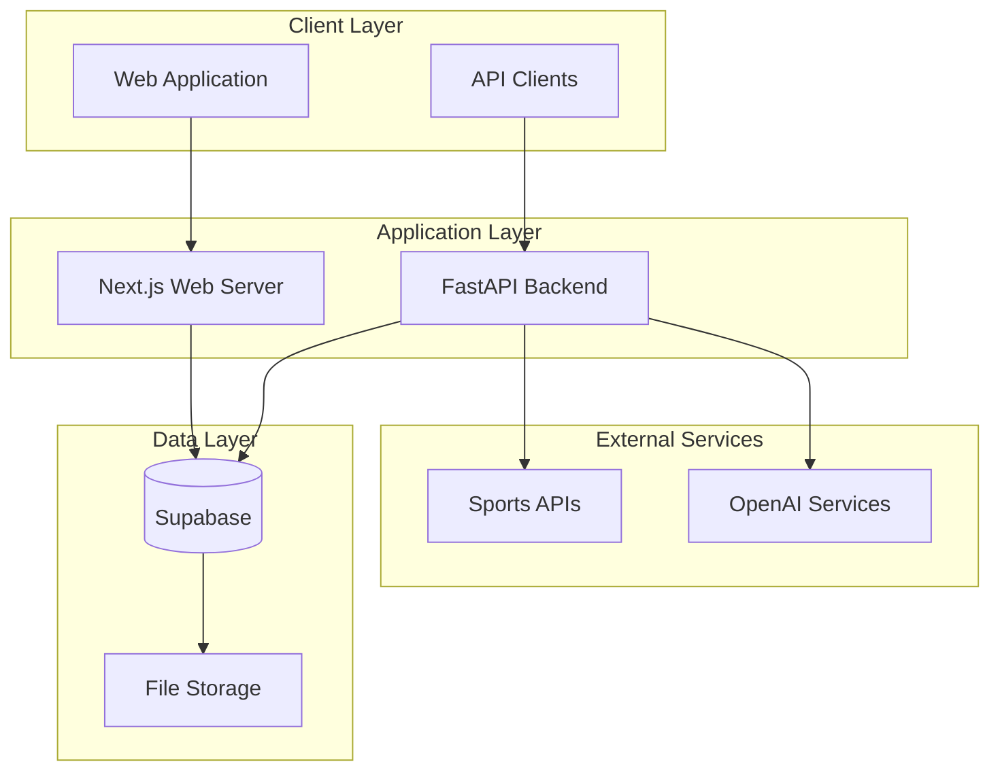
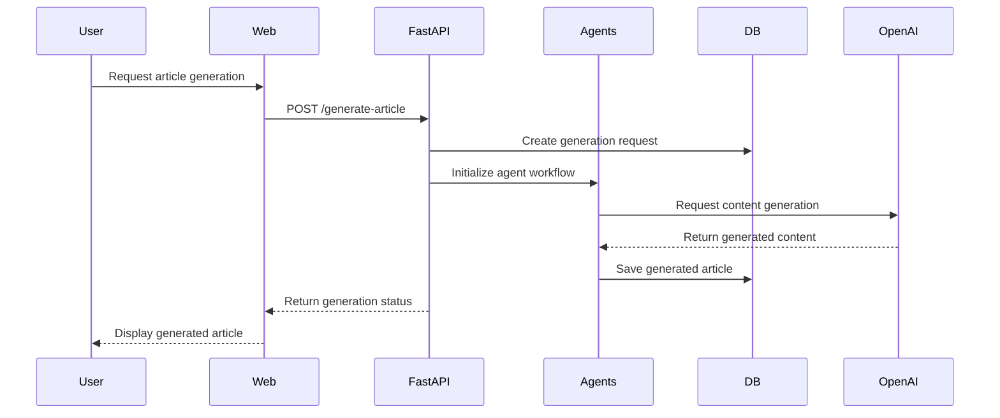
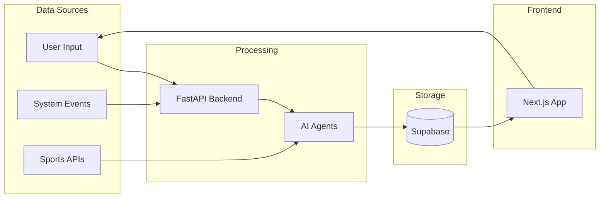
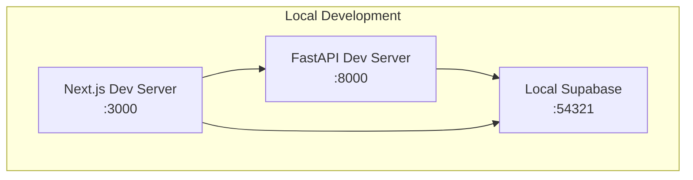
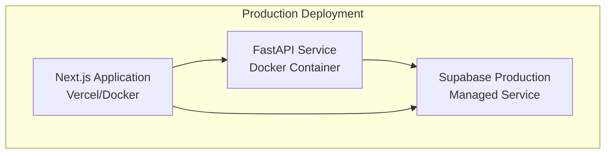

# System Overview

This document provides a high-level overview of the Sport Scribe system architecture, including its core components, data flow, and technology stack.

## Current Architecture (Implemented)

### Core Components
- **Web Platform**: Next.js 14 with TypeScript, HeroUI, and Tailwind CSS
- **AI Backend**: FastAPI service for AI agent coordination
- **Database**: Supabase (PostgreSQL with built-in auth and real-time)
- **Authentication**: Supabase Auth with Row Level Security
- **Deployment**: Docker containers with CI/CD via GitHub Actions

### Data Flow
1. **User Request**: Web platform receives user interaction
2. **AI Processing**: FastAPI backend processes requests using AI agents
3. **Data Storage**: Results stored in Supabase with real-time updates
4. **UI Update**: Web platform updates in real-time via Supabase subscriptions

### Future Planned Components
- Enhanced multi-agent coordination
- Advanced content validation
- Scheduled content generation
- Analytics and monitoring dashboard

## Architecture Overview

Sport Scribe is built using a modern, containerized architecture that prioritizes simplicity and scalability while providing AI-powered sports content generation capabilities.

## Core Components

### 1. Web Platform (Frontend)

**Technology**: Next.js 14, React, TypeScript, Tailwind CSS, HeroUI

The web platform provides the user interface for Sport Scribe, including:

- **Public Website**: Article browsing, search, and reading
- **Admin Dashboard**: Content management and system configuration
- **User Portal**: Profile management and preferences

**Key Features**:
- Server-side rendering (SSR) for SEO optimization
- Real-time updates using Supabase subscriptions
- Responsive design for mobile and desktop
- Component-based architecture with HeroUI

### 2. AI Backend Service

**Technology**: Python, FastAPI, OpenAI Integration

The AI backend handles automated content generation using a basic agent framework:

- **Data Collection Agent**: Basic structure for fetching sports data
- **Writing Agent**: Basic text generation capabilities using AI models
- **Main Orchestrator**: FastAPI endpoints for coordinating agent workflows

**Key Features**:
- RESTful API endpoints
- OpenAI integration for content generation
- Extensible agent framework
- Docker containerization

### 3. Database Layer

**Technology**: Supabase (PostgreSQL)

**Supabase Features**:
- Primary data storage for articles, users, games, and system configuration
- Row Level Security (RLS) for data protection
- Real-time subscriptions for live updates
- Built-in authentication and authorization
- Database migrations and schema management

### 4. External Integrations

**Sports Data APIs**:
- Integration points prepared for sports data APIs
- Extensible architecture for multiple data sources

**AI Services**:
- OpenAI GPT models for content generation
- Configurable model selection and parameters

## Data Flow

### Article Generation Workflow

### Real-time Data Synchronization

## Technology Stack

### Frontend Stack
- **Framework**: Next.js 14 with App Router
- **Language**: TypeScript
- **Styling**: Tailwind CSS
- **Components**: HeroUI (@heroui/react)
- **State Management**: React hooks and context
- **Real-time**: Supabase subscriptions

### Backend Stack
- **Framework**: FastAPI
- **Language**: Python 3.11+
- **AI Integration**: OpenAI API
- **Code Quality**: Ruff (linting and formatting)
- **Type Checking**: mypy
- **Containerization**: Docker

### Database & Infrastructure
- **Database**: Supabase (PostgreSQL)
- **Authentication**: Supabase Auth
- **File Storage**: Supabase Storage
- **Real-time**: Supabase Realtime
- **Deployment**: Docker containers

### Development Tools
- **Version Control**: Git
- **CI/CD**: GitHub Actions
- **Code Quality**: Ruff, ESLint
- **Package Management**: npm, pip
- **Environment**: Docker Compose

## Deployment Architecture

### Development Environment

### Production Environment

## Security Architecture

### Authentication Flow
- **User Authentication**: Supabase Auth with JWT tokens
- **API Authentication**: Service role keys for backend services
- **Row Level Security**: Database-level access control
- **Environment Variables**: Secure configuration management

### Data Protection
- **Encryption**: TLS/SSL for all communication
- **Access Control**: Role-based permissions
- **Input Validation**: Comprehensive request validation
- **Audit Logging**: System activity tracking

## Current Capabilities

The system currently supports:
- Basic article generation workflow
- User authentication and authorization
- Real-time data synchronization
- RESTful API endpoints
- Docker-based deployment
- Development environment setup

## Scalability Considerations

### Horizontal Scaling
- **Stateless Services**: FastAPI backend designed for horizontal scaling
- **Database Scaling**: Supabase handles database scaling automatically
- **Load Balancing**: Ready for load balancer integration

### Performance Optimization
- **Caching**: Prepared for Redis integration
- **Database Optimization**: Indexed queries and efficient schema design
- **API Optimization**: Async/await patterns for I/O operations

## Future Architecture Enhancements

### Planned Improvements
1. **Enhanced Agent System**: More sophisticated AI agent coordination
2. **Background Processing**: Celery or similar for long-running tasks
3. **Caching Layer**: Redis for performance optimization
4. **Monitoring**: Application performance monitoring
5. **Analytics**: User behavior and system metrics

### Integration Roadmap
1. **Phase 1**: Core functionality and basic agent system
2. **Phase 2**: Enhanced AI capabilities and real-time features
3. **Phase 3**: Advanced analytics and monitoring
4. **Phase 4**: Scale optimization and performance tuning

## Development Guidelines

### Code Organization
- **Modular Design**: Clear separation of concerns
- **API First**: Well-defined interfaces between components
- **Configuration Management**: Environment-based configuration
- **Error Handling**: Comprehensive error handling and logging

### Quality Assurance
- **Type Safety**: TypeScript and Python type hints
- **Code Quality**: Automated linting and formatting
- **Testing**: Unit and integration testing framework
- **Documentation**: Comprehensive API and system documentation

This architecture provides a solid foundation for Sport Scribe's AI-powered sports journalism platform while maintaining simplicity and allowing for future enhancements as the system evolves.
