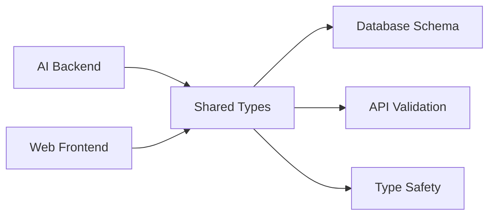

# Shared Directory

This directory contains shared types, schemas, constants, and utilities that are used across both the AI backend and web frontend components of the Sport Scribe platform.

## Directory Structure

```
shared/
├── types/              # TypeScript type definitions
├── schemas/            # Data schemas and validation
├── constants/          # Application constants
└── README.md          # This file
```

## Types (`/types`)

Contains TypeScript interface definitions and types used throughout the application:

- **`article.ts`** - Article-related types, statuses, and metadata
- **`game.ts`** - Game data, statistics, and moment types
- **`player.ts`** - Player profiles, statistics, and injury types
- **`team.ts`** - Team information, roster, and history types
- **`agent.ts`** - AI agent configuration and task types
- **`api.ts`** - API request/response types and authentication

### Usage Example

```typescript
// In AI backend (Python can access via code generation)
import { Article, ArticleStatus } from '../../shared/types/article';

// In web frontend
import { Game, GameStatus } from '@/shared/types/game';
import { Player, PlayerStats } from '@/shared/types/player';
```

## Schemas (`/schemas`)

Contains data validation schemas and database definitions:

### Database Schemas (`/schemas/database`)
- **`articles.sql`** - Article tables, metadata, and relationships
- **`games.sql`** - Game data, statistics, and player performance
- **`users.sql`** - User profiles, permissions, and authentication
- **`init.sql`** - Database initialization and system configuration

### API Schemas (`/schemas/api`)
- **`article-endpoints.json`** - REST API endpoint definitions
- **`webhook-payloads.json`** - Webhook event payload schemas
- **`openapi.yaml`** - Complete OpenAPI specification

### Validation Schemas (`/schemas/validation`)
- **`article-schema.json`** - JSON Schema for article validation
- **`game-schema.json`** - JSON Schema for game data validation

### Usage Example

```sql
-- Run database initialization
\i shared/schemas/database/init.sql
\i shared/schemas/database/users.sql
\i shared/schemas/database/games.sql
\i shared/schemas/database/articles.sql
```

```typescript
// Validate article data
import articleSchema from '@/shared/schemas/validation/article-schema.json';
import Ajv from 'ajv';

const ajv = new Ajv();
const validate = ajv.compile(articleSchema);
const isValid = validate(articleData);
```

## Constants (`/constants`)

Contains application-wide constants and configuration:

- **`sports.ts`** - Sports categories, positions, statistics, and metadata
- **`leagues.ts`** - League information, teams, and competition structures
- **`api-endpoints.ts`** - API endpoint URLs and configuration

### Usage Example

```typescript
import { SPORTS, SPORT_NAMES } from '@/shared/constants/sports';
import { LEAGUES, LEAGUE_INFO } from '@/shared/constants/leagues';
import { API_ENDPOINTS } from '@/shared/constants/api-endpoints';

// Get all supported sports
const supportedSports = Object.values(SPORTS);

// Get league information
const nflInfo = LEAGUE_INFO[LEAGUES.NFL];

// Build API URL
const articlesUrl = API_ENDPOINTS.ARTICLES.LIST;
```

## Integration Patterns

### Web Frontend Integration

```typescript
// Import shared types
import type { Article, Game, Player } from '@/shared/types';

// Use constants
import { SPORTS, LEAGUES } from '@/shared/constants';

// Validate data
import { validateArticle } from '@/shared/validation';
```

### AI Backend Integration

```python
# Access shared schemas
import json
with open('../shared/schemas/validation/article-schema.json') as f:
    article_schema = json.load(f)

# Use shared constants (via generated Python constants)
from shared.constants import SPORTS, LEAGUES
```

## Data Flow



## Validation Rules

### Article Validation
- Title: 10-500 characters, non-empty
- Content: 100-50,000 characters
- Sport: Must be from supported sports list
- Tags: Maximum 20, each 2-50 characters
- Reading time: 1-120 minutes

### Game Validation
- Teams: Home and away teams must be different
- Scores: 0-999 range
- Status: Must be valid game status
- Season: Format 'YYYY' or 'YYYY-YYYY'

### Player Validation
- Position: Must be valid for the sport
- Status: Active, injured, suspended, etc.
- Statistics: Sport-specific validation rules

## Database Design Principles

1. **Row Level Security (RLS)** - All tables have appropriate RLS policies
2. **Audit Trails** - Created/updated timestamps on all tables
3. **Soft Deletes** - Important data is marked as deleted, not removed
4. **Indexing** - Performance indexes on frequently queried columns
5. **Constraints** - Data integrity enforced at database level

## API Design Principles

1. **RESTful** - Standard HTTP methods and status codes
2. **Consistent** - Uniform response format across all endpoints
3. **Paginated** - Large result sets include pagination metadata
4. **Versioned** - API version in URL path (/api/v1/)
5. **Documented** - OpenAPI specification for all endpoints

## Contributing

When adding new shared resources:

1. **Types** - Add TypeScript interfaces with proper JSDoc comments
2. **Schemas** - Include validation rules and error messages
3. **Constants** - Group related constants logically
4. **Documentation** - Update this README with usage examples

### Adding New Types

```typescript
// Example: shared/types/venue.ts
export interface Venue {
  id: string;
  name: string;
  city: string;
  capacity: number;
  surface_type: VenueSurfaceType;
  is_dome: boolean;
}

export enum VenueSurfaceType {
  GRASS = 'grass',
  ARTIFICIAL_TURF = 'artificial_turf',
  CLAY = 'clay',
  HARDCOURT = 'hardcourt'
}
```

### Adding New Constants

```typescript
// Example: shared/constants/venues.ts
export const VENUE_TYPES = {
  STADIUM: 'stadium',
  ARENA: 'arena',
  FIELD: 'field',
  COURT: 'court',
  TRACK: 'track'
} as const;

export const VENUE_CAPACITIES = {
  SMALL: { min: 0, max: 20000 },
  MEDIUM: { min: 20001, max: 50000 },
  LARGE: { min: 50001, max: 100000 },
  MEGA: { min: 100001, max: 200000 }
};
```

## Best Practices

1. **Type Safety** - Use strict TypeScript types with proper constraints
2. **Validation** - Validate all data at API boundaries
3. **Documentation** - Include JSDoc comments for all public interfaces
4. **Consistency** - Follow established naming conventions
5. **Performance** - Consider database indexes and query patterns
6. **Security** - Implement proper RLS policies and input validation

## Related Documentation

- [API Documentation](../docs/api/)
- [Database Schema](../docs/architecture/database-schema.md)
- [Development Guidelines](../docs/development/coding-standards.md)
- [Deployment Guide](../docs/deployment/) 